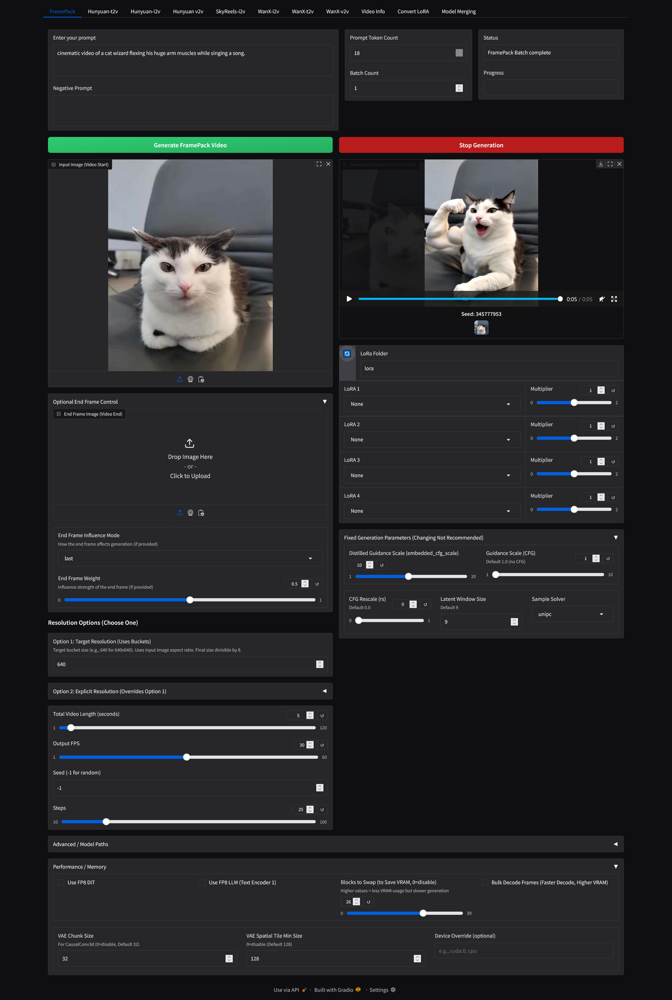

# H1111


This is a GUI for tech wizard kohya-ss's musubi tuner's inference script.
https://github.com/kohya-ss/musubi-tuner

It allows simple inference with hunyuan video model , with video2video, image2video, Skyreels and text2video support.

If you are running out of vram use block swapping and some form of attention besides sdpa or torch and use split attention. Sage attention is the fastest/lowest vram but difficult to install in windows. I would say the easiest to get to run is xformers attention, you can usually get it with "pip install xformers".

Best quality will be obtained without fp8, enabling block swapping and disabling fp8 is not too much of a speed hit.

If you are using a lora that you didn't train with musubi you need to drag it to the convert lora tab and convert it to the default format. It should spit it out into the /lora folder.

This about the speed I get generating a 960x544 97 frame 40 step video without fp8 using sage attention and skyreels on a 4090: 80%|████████  | 24/30 [11:01<02:45, 27.54s/it]

## To Use Skyreels

To use the Skyreels models, first download Kijai's awesome models:

https://huggingface.co/Kijai/SkyReels-V1-Hunyuan_comfy/resolve/main/skyreels_hunyuan_i2v_bf16.safetensors?download=true
and
https://huggingface.co/Kijai/SkyReels-V1-Hunyuan_comfy/resolve/main/skyreels_hunyuan_t2v_bf16.safetensors?download=true

Place the models inside the hunyuan folder inside of H1111 and select them at the bottom of the page by clicking DIT model

Use the i2v model for image to video.
Use the t2v model for video to video and text to video.

Most of the lora's for hunyuan will work with skyreels also.

## changlog

3/1/2025
    Added support for Skyreels Video to Video and Text to Video. 
2/23/2025
    Added initial support for skyreels using musubi's skyreel implementation. (thanks  sdbds && Kijai :D)
download models from https://huggingface.co/Kijai/SkyReels-V1-Hunyuan_comfy and add them to your hunyuan folder
skyreels_hunyuan_i2v_bf16.safetensors
skyreels_hunyuan_t2v_bf16.safetensors

## Requirements

- Python 3.10
- CUDA 12.4

## Basic Installation (Linux)

Tested on ubuntu 24

to update navigate to H1111 and git pull

```powershell
git clone https://github.com/maybleMyers/H1111
cd H1111

#to download models
wget https://huggingface.co/tencent/HunyuanVideo/resolve/main/hunyuan-video-t2v-720p/transformers/mp_rank_00_model_states.pt -P hunyuan
wget https://huggingface.co/tencent/HunyuanVideo/resolve/main/hunyuan-video-t2v-720p/vae/pytorch_model.pt -P hunyuan
wget https://huggingface.co/Comfy-Org/HunyuanVideo_repackaged/resolve/main/split_files/text_encoders/llava_llama3_fp16.safetensors -P hunyuan
wget https://huggingface.co/Comfy-Org/HunyuanVideo_repackaged/resolve/main/split_files/text_encoders/clip_l.safetensors -P hunyuan
#fp8 model
wget https://huggingface.co/kohya-ss/HunyuanVideo-fp8_e4m3fn-unofficial/resolve/main/mp_rank_00_model_states_fp8.safetensors -P hunyuan


python -m venv env
#(if you have another version of python do python3.10 -m venv env after you install it with sudo apt install python3.10 python3.10-venv python3.10-distutils)
source env/bin/activate
pip install torch torchvision --index-url https://download.pytorch.org/whl/cu124 
pip install -r requirements.txt
pip install ascii-magic matplotlib tensorboard wheel gradio==5.14.0 tiktoken ffmpeg ffmpeg-python
pip install flash-attn --no-build-isolation
pip install sageattention==1.0.6
might need python3.10-dev as well for sage attention to work

```

## Basic Installation (Windows)

#download models

https://huggingface.co/tencent/HunyuanVideo/resolve/main/hunyuan-video-t2v-720p/transformers/mp_rank_00_model_states.pt

https://huggingface.co/tencent/HunyuanVideo/resolve/main/hunyuan-video-t2v-720p/vae/pytorch_model.pt

https://huggingface.co/Comfy-Org/HunyuanVideo_repackaged/resolve/main/split_files/text_encoders/llava_llama3_fp16.safetensors

https://huggingface.co/Comfy-Org/HunyuanVideo_repackaged/resolve/main/split_files/text_encoders/clip_l.safetensors

#fp8 dit model

https://huggingface.co/kohya-ss/HunyuanVideo-fp8_e4m3fn-unofficial/resolve/main/mp_rank_00_model_states_fp8.safetensors

place models in H1111/hunyuan folder

First, open PowerShell and navigate to your desired installation directory. Then run these commands:

```powershell
git clone https://github.com/maybleMyers/H1111
cd H1111
python -m venv env
./env/scripts/activate
pip install torch torchvision --index-url https://download.pytorch.org/whl/cu124 
pip install -r requirements.txt
pip install ascii-magic matplotlib tensorboard wheel gradio==5.14.0 tiktoken ffmpeg ffmpeg-python

```

## To run

```
python h1111.py
```

open 127.0.0.1:7860 in a browser

### Optional: Install Xformers
```powershell
pip install --no-deps xformers --index-url https://download.pytorch.org/whl/cu124
```

### Optional: Install Flash Attention
Note: This can take 1-5 hour to install even on a good CPU, but provides faster generation.
```powershell
pip install flash-attn --no-build-isolation
```
```